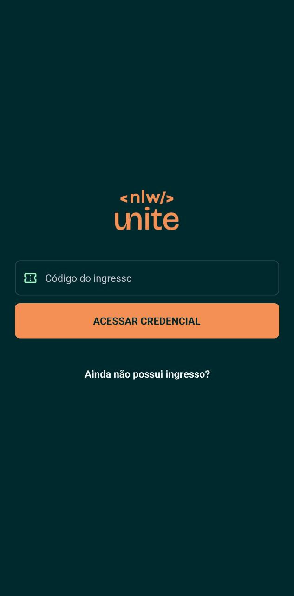
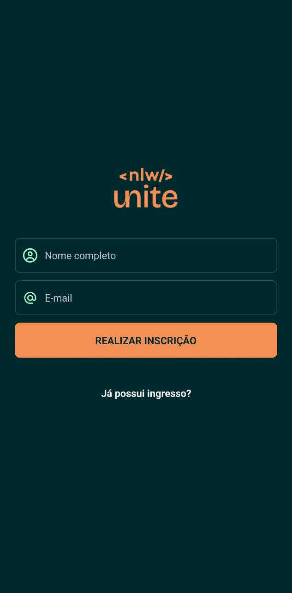
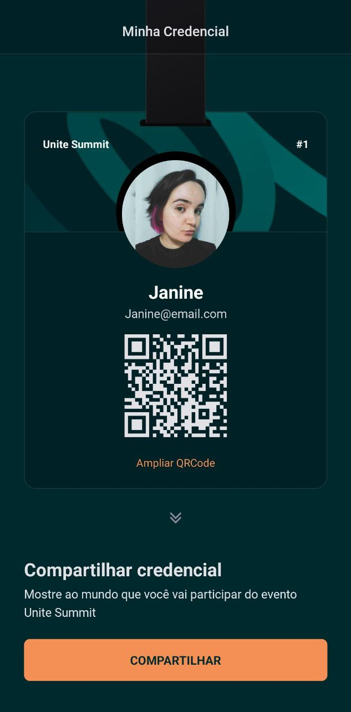

<p align="center">
  
</p>

<p align="center">
Aplicação desenvolvida no NLW Unite da Rocketseat na trilha React Native.
</p>

<br>

<p align="center">
  
  
  
</p>

## 🚀 Tecnologias

Esse projeto foi desenvolvido com as seguintes tecnologias:

- Moti
- React Native
- Tailwind
- TypeScript
- Zustand

## Projeto

Nesse projeto foi desenvolvido a versão mobile de um sistema de check-in para eventos presenciais.

## Instruções para execução

- Clone o repositório de backend em sua máquina local usando o seguinte comando:
  ```bash
  git clone https://github.com/JanineTeodoro/nlw-unite-backend.git
  ```
- Execute pelo terminal do backend o comando:
  ```bash
  npm run dev
  ```
- Clone o repositório de mobile em sua máquina local usando o comando:
  ```bash
  git clone https://github.com/JanineTeodoro/nlw-unite-mobile.git
  ```
- Execute pelo terminal do mobile os comandos:
  ```bash
  npm install

  npx expo start
  ```

## Contato
- **Nome:** Janine Leite Teodoro
- **Email:** janineteodoro@hotmail.com
- **Linkedin:** https://www.linkedin.com/in/janineteodoro/
